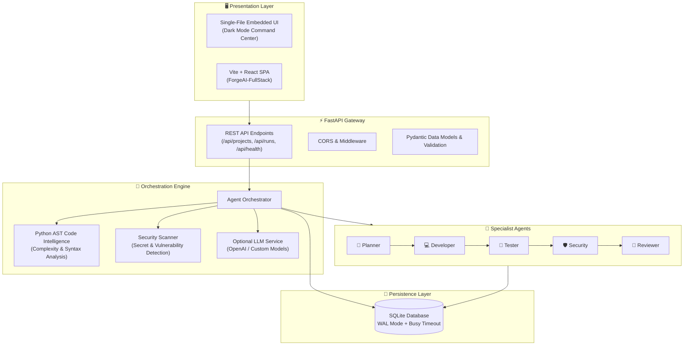

# ForgeAI — Multi-Agent Software Engineering Workspace

[](https://github.com/AkkapallySaiCharan/Forge-AI)
[](https://www.python.org/)
[](https://fastapi.tiangolo.com/)
[](https://vitejs.dev/)
[](https://sqlite.org/)
[](https://docs.pytest.org/)

An autonomous multi-agent software engineering workspace that coordinates specialized AI agents through a centralized orchestration layer to analyze requirements, plan implementations, generate comprehensive test cases, scan for security vulnerabilities, and provide automated merge verdicts.

---

## 📑 Table of Contents

- [Overview](#-overview)
- [System Architecture](#-system-architecture)
- [Specialized Agent Pipeline](#-specialized-agent-pipeline)
- [Project Flavors](#-project-flavors)
- [Getting Started](#-getting-started)
  - [Option A: Standalone Single-File App (Recommended for Quick Demo)](#option-a-standalone-single-file-app)
  - [Option B: Decoupled Full-Stack Architecture](#option-b-decoupled-full-stack-architecture)
- [API Reference](#-api-reference)
- [Configuration & Environment Variables](#-configuration--environment-variables)
- [Automated Testing](#-automated-testing)
- [Production Roadmap](#-production-roadmap)
- [Author & Repository](#-author--repository)

---

## 🌟 Overview

ForgeAI simulates an elite engineering team pipeline. Given an engineering task and optional source code, ForgeAI delegates tasks across five specialized agents:

1. **Planner Agent**: Decomposes specifications into discrete, actionable architectural milestones.
2. **Developer Agent**: Formulates modular, testable implementation strategies without breaking interfaces.
3. **Testing Agent**: Produces happy-path, boundary-value, exception, and regression test suites.
4. **Security Agent**: Executes static analysis security testing (SAST) and pattern-matching for secrets, SQL injection, unsafe deserialization, and command execution risks.
5. **Reviewer Agent**: Calculates an engineering quality score (0–100) and issues an authoritative pull-request verdict (`APPROVE`, `APPROVE WITH CHANGES`, or `REQUEST CHANGES`).

> **Zero-Dependency Demo Mode**: Runs immediately out-of-the-box without requiring an API key using deterministic heuristics and Python AST parsing. Live LLM reasoning (OpenAI/compatible) can be toggled on by setting `OPENAI_API_KEY`.

---

## 🏛 System Architecture

ForgeAI supports both single-file embedded deployment and decoupled full-stack client-server architecture:



---

## 🤖 Specialized Agent Pipeline

| Agent | Responsibility | Key Outputs |
| :--- | :--- | :--- |
| **🧠 Planner Agent** | Requirements engineering & system architecture decomposition | Step-by-step implementation milestones, affected modules, acceptance criteria |
| **💻 Developer Agent** | Code strategy & design pattern recommendations | Modular refactoring approach, separation of concerns, backwards compatibility guidelines |
| **🧪 Testing Agent** | Quality assurance & regression analysis | Unit tests, boundary conditions, empty/null validation, exception handling tests |
| **🛡️ Security Agent** | Static application security testing (SAST) & secrets audit | Detection of hardcoded credentials, dynamic `eval`/`exec`, shell injection, SQL injection, TLS bypass |
| **👀 Reviewer Agent** | Quality assurance audit & code approval | 0–100 quality score, prioritized merge recommendations, final verdict (`APPROVE` / `REQUEST CHANGES`) |

---

## 📦 Project Flavors

This repository provides two ways to run ForgeAI depending on your workflow:

| Feature | Single-File Workspace (`forgeai_app.py`) | Decoupled Full-Stack (`Forge-AI/ForgeAI-FullStack`) |
| :--- | :--- | :--- |
| **Use Case** | Quick demonstrations, portfolios, rapid local prototyping | Multi-developer projects, modular enterprise scaling |
| **Frontend** | Embedded dark-mode UI with live agent visualizer | React 18 + Vite SPA |
| **Backend** | Integrated FastAPI REST server | Standalone modular FastAPI backend |
| **Startup** | Single command (`python forgeai_app.py`) | Two terminal processes (`backend` + `frontend`) |
| **Database** | SQLite (`forgeai.db`) | SQLite (`Forge-AI/ForgeAI-FullStack/backend/forgeai.db`) |

---

## 🚀 Getting Started

### Prerequisites
- **Python 3.10+** (Tested on Python 3.10, 3.11, 3.12, 3.14)
- **Node.js 18+** & **npm** *(Only required if running Option B)*

---

### Option A: Standalone Single-File App

The entire application (FastAPI backend, embedded dark-theme dashboard, multi-agent engine, and SQLite database) runs from a single file:

1. **Clone the repository**:
   ```bash
   git clone https://github.com/AkkapallySaiCharan/Forge-AI.git
   cd Forge-AI
   ```

2. **Install Python dependencies**:
   ```bash
   pip install fastapi uvicorn pydantic httpx pytest
   ```

3. **Launch the application**:
   ```bash
   python forgeai_app.py
   ```

4. **Open your browser**:
   - **Dashboard**: [http://127.0.0.1:8000](http://127.0.0.1:8000)
   - **API Docs (Swagger)**: [http://127.0.0.1:8000/docs](http://127.0.0.1:8000/docs)
   - **Health Check**: [http://127.0.0.1:8000/api/health](http://127.0.0.1:8000/api/health)

---

### Option B: Decoupled Full-Stack Architecture

To run the decoupled React + Vite frontend and FastAPI backend separately:

#### 1. Backend Service
```powershell
cd Forge-AI/ForgeAI-FullStack/backend
python -m venv .venv
.\.venv\Scripts\Activate.ps1   # On Linux/macOS: source .venv/bin/activate
pip install -r requirements.txt
uvicorn app.main:app --reload
```
*API running at [http://127.0.0.1:8000](http://127.0.0.1:8000)*

#### 2. Frontend Application
In a separate terminal:
```powershell
cd Forge-AI/ForgeAI-FullStack/frontend
npm install
npm run dev
```
*Frontend running at [http://localhost:5173](http://localhost:5173)*

---

## 📡 API Reference

| Method | Endpoint | Description | Payload / Response |
| :--- | :--- | :--- | :--- |
| `GET` | `/api/health` | Service health status, database connection, LLM mode | `{"status": "healthy", "llm_mode": "demo"}` |
| `GET` | `/api/projects` | List all tracked software projects | Array of project objects |
| `POST` | `/api/projects` | Create a new project container | `{"name": "...", "description": "..."}` |
| `DELETE`| `/api/projects/{id}`| Remove project and all associated runs | `{"status": "deleted"}` |
| `GET` | `/api/runs` | Fetch latest runs with execution statuses | Array of run summaries |
| `POST` | `/api/runs` | Trigger multi-agent pipeline on a task | `{"project_id": "...", "task": "...", "code": "..."}` |
| `GET` | `/api/runs/{id}` | Detailed output with all 5 agent results & scores | Full run result including individual agent telemetry |

---

## ⚙️ Configuration & Environment Variables

ForgeAI runs out of the box without any environment variables. You can configure optional features:

| Variable | Default | Purpose |
| :--- | :--- | :--- |
| `PORT` | `8000` | Port for the FastAPI server |
| `OPENAI_API_KEY` | *(None)* | Enables live OpenAI model reasoning instead of demo mode |
| `OPENAI_MODEL` | `gpt-4o-mini` | Target OpenAI model identifier |
| `GITHUB_TOKEN` | *(None)* | Optional Personal Access Token for GitHub repository inspection |

To enable live LLM mode:
```powershell
# Windows PowerShell
$env:OPENAI_API_KEY="your-openai-api-key"
python forgeai_app.py

# Linux / macOS
export OPENAI_API_KEY="your-openai-api-key"
python forgeai_app.py
```

---

## 🧪 Automated Testing

ForgeAI includes full test coverage for API endpoints, agent pipelines, AST intelligence, and security scanning.

Run all tests from the repository root:
```bash
python -m pytest -v
```

Output:
```text
Forge-AI/ForgeAI-FullStack/backend/tests/test_api.py::test_health PASSED
Forge-AI/ForgeAI-FullStack/backend/tests/test_orchestrator.py::test_all_agents_run PASSED
tests/test_forgeai_app.py::test_health_endpoint PASSED
tests/test_forgeai_app.py::test_root_endpoint PASSED
tests/test_forgeai_app.py::test_python_metrics PASSED
tests/test_forgeai_app.py::test_security_scan PASSED
tests/test_forgeai_app.py::test_create_project_and_run PASSED

======================== 7 passed, 1 warning in 2.57s =========================
```

---

## 🗺️ Production Roadmap

- [x] Multi-agent orchestration pipeline (5 specialist agents)
- [x] Single-file zero-dependency demo application
- [x] Decoupled React/Vite full-stack implementation
- [x] SQLite persistence with WAL mode & busy timeout
- [x] Automated test suite & CI-ready pytest configuration
- [ ] PostgreSQL + async SQLAlchemy persistence for multi-tenant support
- [ ] Celery / Redis task queues for distributed background workers
- [ ] Sandboxed Docker container execution for running untrusted code & tests
- [ ] GitHub Webhook integration for automatic PR reviews and commenting

---

## 👤 Author & Repository

- **Repository**: [AkkapallySaiCharan/Forge-AI](https://github.com/AkkapallySaiCharan/Forge-AI)
- **Author**: Akkapally Sai Charan
